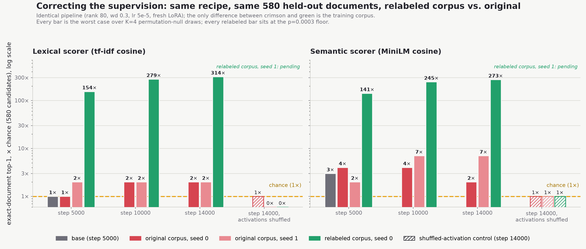

# A working NLA for the GPU-poor

**The question this project asked. Can you train a generative Natural
Language Autoencoder on a 4 GB GTX 1650 Ti?**

**The answer is yes.** This repo holds the result data and figures behind
every claim. The full writeup is on Medium (link coming at publication) and
a methodology paper is in preparation.


## What's here

An NLA is a pair of fine-tuned models. An Activation Verbalizer (AV) turns
a vector from inside a target model into a short description, and an
Activation Reconstructor maps the description back. This project trained
one for google/gemma-4-E2B on a used $700 laptop, evaluated it with
pre-committed gates and positive controls, rebuilt its benchmark when the
first eval turned out to be measuring the wrong thing, and then improved it
with GRPO for about $200 of decade-old GPUs.

Key numbers, each traceable to a JSON in `results/`.

- Round-trip faithfulness (v0, 42 held-out rows) mean cosine 0.438, worst
  row 0.313, every row above the pre-committed 0.30 gate.
- Exact-document retrieval among 580 held-out candidates went from 3x
  chance (base) to 9x chance after 500 GRPO steps (seed 0; the independent
  seed 1 reached 7x), and transferred to a lexical metric the reward never
  saw.
- A blind judge from a different model family preferred the trained model
  in 28 of 36 decided comparisons (p = 6e-4).
- On 295 never-seen documents across 4 unseen domains, a topic-level
  ranking signal survives (mean own-doc percentile 0.376 vs base 0.428 vs
  0.5 chance, paired dense-vs-base p = 0.008). This lead lives in the
  semantic-embedding metric; the lexical metric is flat out of distribution,
  and exact top-1 is at chance for both models. So topic-level ranking
  generalizes to unseen domains; word-for-word document identification does
  not.
- Causal patching places the improvement early, at the injection site,
  with late-layer processing becoming more distributed. Direction
  replicated across seeds.

## Weights

- Base AV/AR pair. [av-v0_0_1](https://huggingface.co/Solshine/gemma-4-e2b-nla-L23-av-v0_0_1) / [ar-v0_0_1](https://huggingface.co/Solshine/gemma-4-e2b-nla-L23-ar-v0_0_1)
- GRPO-improved AV, seed 0. [av-grpo-dense500](https://huggingface.co/Solshine/gemma-4-e2b-nla-L23-av-grpo-dense500)
- GRPO-improved AV, seed 1. [av-grpo-dense500-s1](https://huggingface.co/Solshine/gemma-4-e2b-nla-L23-av-grpo-dense500-s1)
- More checkpoints under the [Solshine](https://huggingface.co/Solshine) namespace.

## Files

- `figures/` publication figures (hand-drawn infographics + data charts)
- `results/` evaluation JSONs. Naming. `step_005000_*` is the base model,
  `dense500*` the GRPO-improved model (s1 = second seed), `*_n580_*` the
  held-out set, `*_n295_*` the never-seen fresh set, `judge2afc_*` the
  blind-judge verdict, `t2_summary_*` the causal-patching contrasts.

## Verify the numbers yourself (no GPU)

Every headline number above traces to a JSON in `results/`. To confirm that,
with nothing but a Python install and no model download, run

```
python verify_claims.py
```

It re-derives all 21 headline claims from the committed data and prints a
pass/fail table. Regenerating the JSONs from scratch needs the HuggingFace
adapters plus the eval harness, which ships with the methodology paper; this
script checks that the published data is self-consistent with the published
claims.

Evaluation conventions worth copying. Every retrieval stat is reported as
the worst case across 4 negative-sampling seeds (max p-value, min effect).
Every harness carries a positive control. If your permutation null ever
comes back with zero variance, stop and check your metric.

Training code, the full eval harness, and the NLAttack v2 benchmark spec
release with the paper.

Questions or replications welcome. Find me on
[LinkedIn](https://www.linkedin.com/in/caleb-deleeuw-08509390/).

## Update 2026-09-02: a plain supervised model on corrected labels beats the GRPO winner by roughly 30x

Since the numbers above were written, an audit of the training corpus found that its
labels were short topic summaries rather than the "what has the model integrated at this
point" descriptions the labeling instruction asked for. The corpus was relabeled with a
corrected rubric (82.5% clean on an independent audit of 120 rows), and the same
long-horizon supervised recipe that produced the base decoder was retrained on it. No
reinforcement learning was involved.

- Exact-document retrieval among the same 580 held-out candidates: **314x chance by
  tf-idf and 273x by semantic similarity at step 14000** (154x/141x at step 5000,
  279x/245x at 10000), permutation p at its floor at every step. Shuffling the
  activations returns both to chance; removing the injection collapses the output to a
  single template. Files: `results/relabel_v1/`.
- A matched ablation retrained the *original* corpus through the identical pipeline in
  two seeds. Its tf-idf channel stays null; its semantic channel reaches 7x in one seed
  and 2x in the other at step 14000. Files: `results/ablation_original_corpus/`.
- Read together: the pipeline explains at most a 7x effect in one seed; the corrected
  labels explain the rest. The binding constraint on this construct at this scale was
  the content of the supervision signal, not compute, injection channel, model capacity,
  or reward design.

Caveats, stated up front: one training seed for the relabeled run (a second is queued);
the relabeled corpus overlaps the original on about 81% of documents, so "which corpus"
is isolated but "label style alone" is not (a row-matched relabel is queued); the
routing-vs-content decomposition has not been extracted for these checkpoints; and the
checkpoint is not yet on Hugging Face (release under the `Solshine` namespace pending).



The figure above (`figures/fig_nla_relabel_comparison.png`) is generated from the
JSONs in `results/relabel_v1/` and `results/ablation_original_corpus/`;
`figures/fig_nla_checkpoint_landscape.png` is the paper's every-checkpoint
overview with the relabel result added on a log axis.

`verify_claims.py` now also checks these numbers. It additionally lists, as failures,
the round-2 and follow-up files the methodology paper cites that have not yet been
copied into `results/` from the source project's private provenance backup; see
`results/PENDING_FROM_BACKUP.md` for the manifest. The script will report a clean run
only once those land, which is deliberate.
